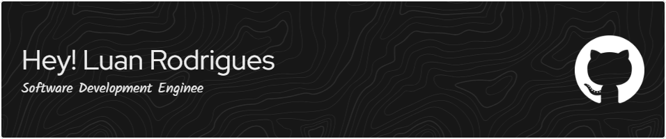

### Hi there 👋


As a Software Development Engineer, I specialize in creating robust and efficient backend solutions. With a focus on software architecture design, I have expertise in crafting scalable solutions across various technologies and frameworks.

As a senior professional, I am dedicated to staying updated on industry trends and utilizing my passion for software architecture to contribute effectively to projects.

```py
from github import Developer


class AboutMe(Developer):
    name = "Luan"
    last_name = "Rodrigues"
    position = "Software Development Engineer 3"
    nationality = "Brazilian"
    langauges = ["Portuguese", "English"]
```

- 🎓 Computer Science Bachelor Degree.
- 🌱 I’m currently working with Golang and ecossystem
- 💌 How to reach me:
  - professional email: luan.rodrigues@wexinc.com
  - personal email: luanrodriguesbusiness@hotmail.com
- ⚡ Fun fact: I'm a windows user.
- ☁ Checkout my [personal website](https://darknessrdg.github.io/)

### Hands-on Skills


💪 Programing Languages

[](https://skillicons.dev)

🔨 Frameworks

[](https://skillicons.dev)

💾 Databases

[](https://skillicons.dev)

Tools

[](https://skillicons.dev)


### :zap: Recent Activity

<!--START_SECTION:activity-->
<!--END_SECTION:activity-->